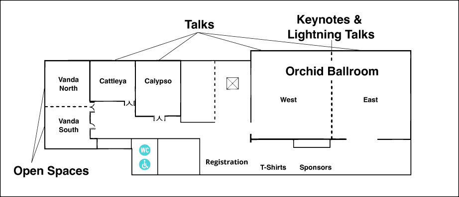
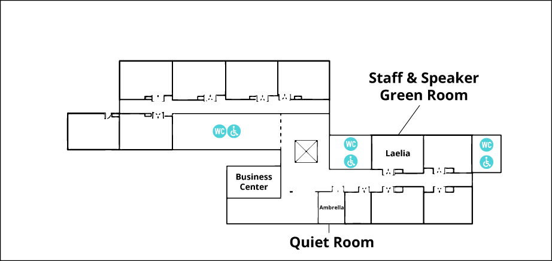

# PyOhio 2024 Venue

PyOhio 2024 will be held at [The Westin Cleveland Downtown](https://www.marriott.com/en-us/hotels/clewi-the-westin-cleveland-downtown/) located at 777 St Clair Ave NE, Cleveland, OH.

PyOhio does not provide an official parking location but there are [a number of parking options](https://en.parkopedia.com/parking/locations/westin_hotels_%26_resorts_777_saint_clair_ave_ne_cleveland_ohio_44114_united_states_jag5dpmuj5d0sp5733/?country=us&arriving=202407270800&leaving=202407272100) within a short walk.

## Conference Spaces

- Masks must be worn in all conference spaces. See [Health & Safety Guidelines](/2024/about/health-and-safety) for details.
- You can take the first elevator in the hotel lobby to the 6th and 7th floor event spaces.
- Restrooms are available on the 6th and 7th floors.

### 6th Floor

**Keynotes, Plenaries, & Lightning Talks:** Orchid Ballroom (combined)

**Talks:** Orchid Ballroom West, Orchid Ballroom East, Calypso, Cattleya

**Open Spaces:** Vanda North, Vanda South

**Registration:** 6th Floor Foyer

**T-Shirts & Sponsors:** Orchid Ballroom Hallway

### 7th Floor

_**Note:** Other events that do not adhere to PyOhio's Health & Safety guidelines will be taking place on the 7th Floor._

**Quiet Room:** Ambrella is open to all conference attendes seeking a quiet space away from the main conference area. Please mute electronic devices and refrain from talking in this room.

**Staff & Speaker Green Room:** Laelia is the staff office and speaker green room to be used for conference business and speaker preparation. Speakers are welcome at all times during the conference.

**Business Center:** The 7th floor business center has a Business Center that is available to PyOhio attendees as well as other guests of the venue.
